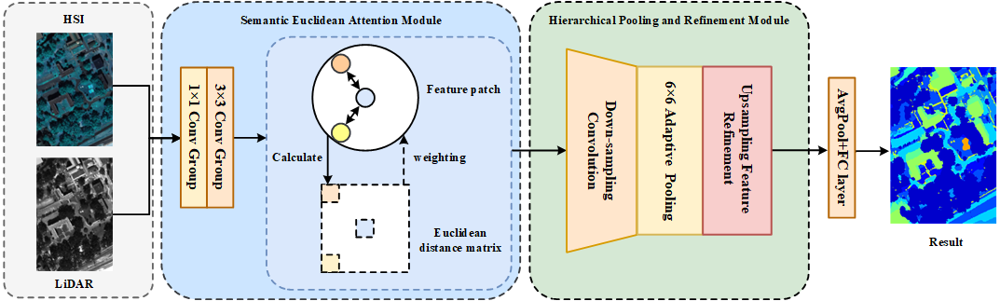

# **MuSeS-Net: Multimodal Semantic-Scale Network for Remote Sensing Image Classification - Code Implementation**

**[ACM MM 2025]** 

  

> **Summary**: MuSeS-Net enhances multimodal remote sensing image classification by combining semantic self-attention and convolutional features through SEAM and HPRM modules, achieving higher accuracy with lower complexity.


## **Start ▶️**  

### **1. Environment**  

- Python 3.10
- PyTorch 2.1.1 
- Numpy 1.26.4
- scipy 1.11.4
- matplotlib 3.8.0
- sklearn 1.2.2


### **2. Model**  
- **Model file**: [MuSeS_Net.py]  
- **Logger file**: [logger.py]  
- **Other Toolkits**: [utils.py]  


### **3. Training & Testing**  
```bash
python MuSeS_Net_train.py
```  


## **License**  
This project is released under the **[MIT License](LICENSE)**.  

---